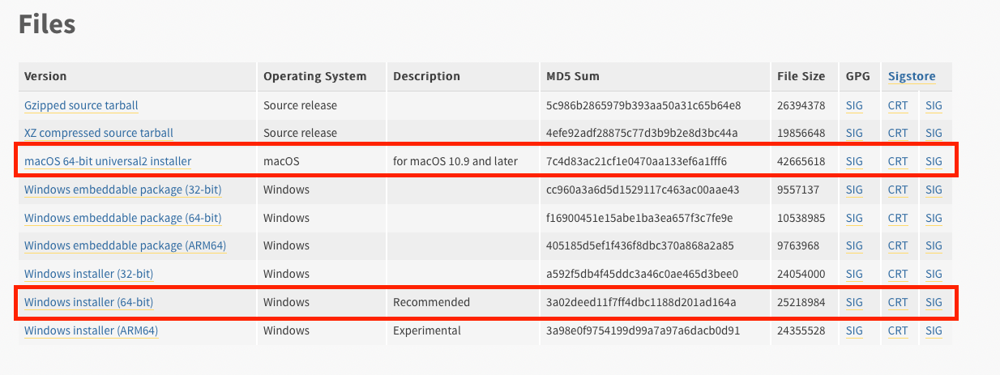
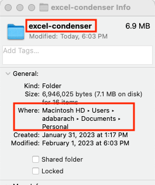
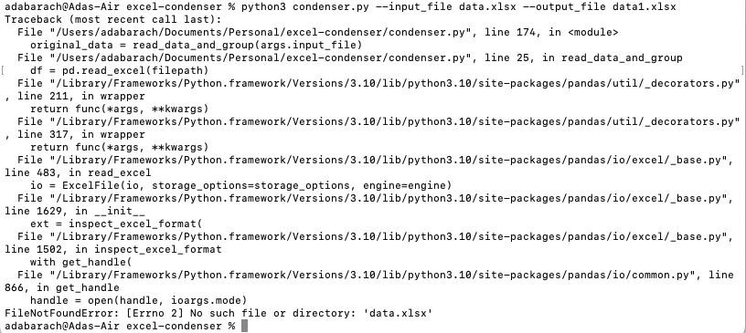
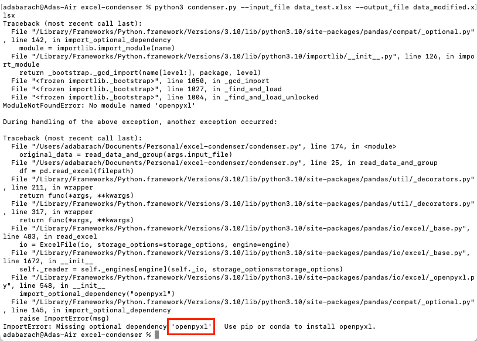

# excel-condenser
An Excel condenser tool which takes a specific-format Excel file provided by Priority Group and condenses the nearly duplicate rows into a signle row with added columns. 

## Table of Contents
- [Installing Python](##installingpython)
- [Setting up `excel-condenser` for the First Time](##settingup`excel-condenser`forthefirsttime)
	- [On a Windows Computer](###onawindowscomputer)
	- [On a Mac Computer](###onamaccomputer)
- [Folder Structure](##folderstructure)
- [Running `excel-condenser`](##running`excel-condenser`)
- [Common Error Messages and Solutions](##commonerrormessagesandsolutions)


## Installing Python
1. Go to [https://wwww.python.org/downloads/release/python-3111/](https://www.python.org/downloads/release/python-3111/). 
2. Scroll to the bottom of the page to the "Files" tables. 
3. Select the correct installer for your computer architecture (most likely "Windows Installer (64-bit)" or "macOS 64-bit universal2 installer"). 


4. After the download is complete, run the .exe file you just downloaded (should be named `python-3.11.1.exe` and can be double-clicked from wherever you saved it).
5. The installation wizard should be running, select option "Install Now". Your computer will prompt you for permission for the installer to modify your computer. Say yes. The installation should then begin on its own. 

## Setting up `excel-condenser` for the First Time
1. Download [this repository](https://github.com/abarach/excel-condenser) as a .zip file by clicking the green "Code" button and select "Download ZIP".
2. Extract the files from the .zip into the directory that you'll run the program from. 
	- This directory should contain files called `condenser.py` and `requirements.txt`. 

### On a Windows Computer
3. Open the Windows terminal (you can run the terminal by searching "cmd" in the search box in the taskbar and selecting "Command prompt"). 
4. Enter the following command where `[file path]` is replaced by the location of the directory with the program files. As a check, if you enter `dir` into the terminal at this point, the Python files and input Excel sheet should be listed in the output. 
```
$ cd [file path]
```
5. Install the required Python packages using the following command:
```
$ pip install -r requirements.txt
```

### On a Mac Computer
3. Open the the Terminal app. This can be found in the Applications folder or by searching "terminal" in Launchpad. 
4. Enter the following command where `[file path]` is replaced by the location of the directory with the program files. As a check, if you enter `ls` into the terminal at this point, the Python files and input Excel sheet should be listed in the output.
	- The file path to the directory can be found by right-clicking on the directory and selecting "Get Info". Under "General" there will be a "Where" line containing the file path. You can ignore the "Macintosh HD" but need to add a '/' to the beginning of the path and then add '/' plus the folder name to the end. For example, the following screenshot translates to the path `/Users/adabarach/Documents/Personal/excel-condenser/`
```
$ cd [file path]
```


5. Install the required Python packages using the following command:
```
$ pip install -r requirements.txt
```

## Folder Structure
- `condenser.py` - the Python program to run
- `README.md` - the User's guide, in Markdown
- `requirements.txt` - contains the required Python packages. These can be installed using the command `pip install -r requirements.txt`
- `UsersGuide.pdf` - this README as a PDF. 

## Running `excel-condenser`
1. Save the desired input Excel document into the same directory as above (which contains the `condenser.py` file). This file should contain only one worksheet. See the `data/data_test.xlsx` file for an example.
2. Open a terminal and enter `cd [file path]` where `[file path]` is replaced by the location of the `excel-condenser` folder. 
3. Enter the following command into the terminal to run the program. 
	```
	$ python3 condenser.py --input_file [path1] --output_file [path2]
	```
	where `[path1]` is replaced by the file path to the location of the input Excel file and `[path2]` is the file path at which you want the outputted Excel file to saved. 
	- If you saved the input Excel file into the same directory as the Python file, then you can simply put the file name in place of `[path1]`. 
	- If you want to save the outputted Excel file into the same directory as the Python file, then you can simply put the fiel name in place of `[path2]`. 
4. The program should only take a few seconds to run. 
5. The directory containing the Python file (or the directory you specified in `[path2]` above) should now contain a file with the name specified by `[path2]` above. This is the output from the Python program and can be moved or renamed to whatever you like. If you do not rename this file, it will be overwritten if the program is run again with the same `[path2]`. 

## Common Error Messages and Solutions
1. The below error indicates that the program cannot find the input Excel file. This likely occurred due to an incorrect file path (`[path1]` above). 


2. This error occurs if the requirements from the `requirements.txt` file were not installed properly. Repeat stepf f) from Setting up `excel-condenser` for the First Time. 

	- Alternatively, you can manually install the requirement. The red box highlights the package that needs to be installed. In this example, the package is `openpyxl`. To install the requirement, enter the following command into the terminal. The installation may prompt you to confirm the download by entering `y` for yes.
```
$ pip install openpyxl
```

## Author
- Ada Barach
